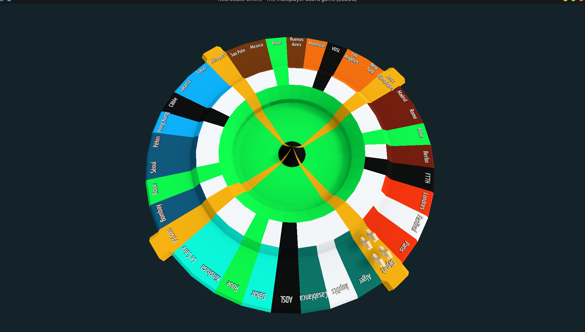
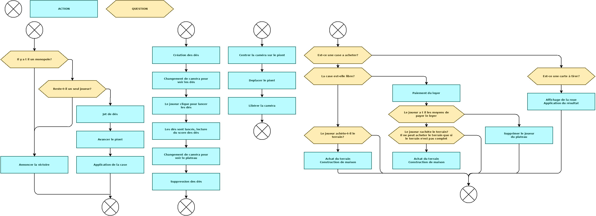

# Classic game mod

## Rules

### Matériel requis

#### Plateau
Le tout se déroule sur un plateau de jeu possédant 4 côtés, dont 9 cases par côté.

#### Dés
Deux dés a 6 faces sont présents, chaque joueur joue a tour de rôle, le premier est déterminé aléatoirement par l'ordinateur.

#### Cases spéciales
4 cases spéciales une située à chaque angle.

##### Case départ
Tous les joueurs s'y trouvent au départ, et si un joueur tombe dessus il double son salaire. A chaque fois qu'un joueur passe sur la case départ il touche son salaire.

On peut alors choisir de changer sa méthode d'imposition (proportionnelle/fixe).

##### Prison
Les joueurs sont envoyés en prison soit via des cartes hasards/anarchies ou lorsqu'ils ont fait 3 doubles d'affilés.

Pour sortir le joueur doit soit faire un double et il sortira immédiatement mais ne rejoue pas, il avance pas.

Soit s'acquitter d'une amende de X $, et sortira au tour d'après.

Au bout de 3 tours, le joueur doit payer pour sortir.

###### Action spéciale
Soudoyer le maton pour éteindre la caméra pendant 1 lancé de dés.

##### Jeux olympiques
Lorsqu'on tombe sur cette on peut décider de payer X$ pour organiser les jeux olympiques dans notre ville. A chaque fois que les jeux sont organisés, les frais d'organisation augmentent de 50%, tandis que le ratio des revenus est doublé. Le premier ratio est de 50%. Autrement dit si une ville devait rapporter 50$, elle en rapportera 50 * 1.5 (150%) = 75$

##### Aéroport
En payant X$, le joueur pourra se rendre sur n'importe quelle case du plateau, s'il franchit la case départ il touche son salaire.

Seules les cases départ, Jeux olympiques ainsi que les cases qui sont contrôlées par les concurrents ne sont pas atteignables.

##### 4x merveilles par partie (mais sélectionnées aléatoirement)
###### Liste des cases
- Tour eiffel: Paris
- Pyramides: Le Caire
- Stade Olympique: Montréal
- Empire state building: New-York
- Hollywood: Los Angeles
- Zocalo: Mexico
- Avenida Paulista: Sao Polo
- La Casa Rosada: Buenos Aires
- Plaza Mayor: Madrid
- Colisee: Rome
- Porte de brandebourg: Berlin
- Big Ben: Londres
- Ruelles de la Casbah: Alger
- Mosquée Hassan: Casablanca
- Bacary Traoré: Dakar
- Nyiragongo: Kinshasa
- Les jardins secrets: Séoul
- La Cité interdite: Pékin
- Le fort de Tung Chung: Honk-Kong
- Monument Nasional: Jakarta
- Shibuya: Tokyo

###### Prix
1. 1.0 x X$
2. 1.5 x X$
3. 3.0 x X$
4. C'est la WIN

#### Case impôts
##### Paiement proportionnel:
- Chaque maison coûte X
- Chaque hotel coûte X
Pas de montant minumum

##### Paiement montant fixe:
- Paie X$, le montant est doublé tous les 3 tours.

#### Case Festival
La case festival permet de nommer aléatoirement 3 villes du plateau dont les revenus sont doublés. Les villes sont choisies au hasard.

S'ils le souhaitent, les joueurs peuvent enchérir pour choisir ou un festival va se dérouler. Les deux autres seront placés aléatoirement.

#### Évènements spéciaux
Lorsqu'un festival a lieu dans une de vos villes, les loyers sont doublés.

#### Cartes hasards (à jouer immédiatement sur soi)
1. Erreur en votre faveur, la banque vous verse des dividendes de X$.
2. Rendez-vous X rue
3. Reculez de trois cases
4. Allez en prison, ne passez pas par la case départ, ne recevez pas votre salaire.
5. Vous faites la bamboche et amenez vos potos, le prochain loyer sera payé double.
6. Vous gagnez une protection, elle protège la ville que vous souhaitez du prochain effet qui lui serait appliqué.
7. Vous jouez en bourse, et vous perdez immédiatement la moitié de votre argent liquide.
8. Vous passez en mode d'impôsition proportionel
9. Vous passez en mode d'impôsition fixe
10. Il y a des manifestations dans une de vos villes, elle ne rapporte rien durant 2 tours de plateau.
11. Une émission de télé vient rénover une de vos villes. Vous pouvez construire une maison gratuitement sur une de vos villes.
12. Du a une épidémie tous les festivals et autres spectacles sont annulés pendant 2 tours (jeux olympiques, festival et gares ne sont plus accessible, leurs loyers sont nuls).
13. Un de vos locataires vous fait faux bonds, le prochain loyer ne sera pas perçu.

#### Cartes anarchies (a jouer quand on le souhaite)
1. Des jeunes squattent votre logement, l'habitation n'est plus aux normes, vous perdez un batiment.
2. Vous pouvez soudoyer le notaire pour X$, ce qui va permettre de libérer une rue au hasard sur la ligne ciblée.
3. Vous pouvez prendre une carte dans la main d'un de vos concurrents.
4. Vous pouvez annuler les prochains jeux olympiques, ils retournent alors sur leur case de base.
5. Vous forcez un de vos camarades a jouer en bourse pour qu'il perde la moitié de son argent liquide. (à jouer sur un adversaire)
6. Vous forcez un de vos camarades a passer en mode d'impôsition proportionnel.
7. Vous avez une carte sortie de prison, peut etre vendue ou alors utilisée.
8. Vous forcez un de vos camarades a passer en mode d'impôsition fixe.
9. Grève des éboueurs sur un côté de plateau (vous choisissez lequel). Les loyers de ce bord ne rapportent rien pendant jusqu'au prochain tour de plateau.
10. Un festival auto-organisé s'invite dans une ville, vous choisissez laquelle. Le festival dure jusqu'au prochain tour de plateau.
11. Des streameurs organisent une campagne a but non lucrative en votre nom, vous percevez X$.
12. A tout moment vous pouvez jouez cette carte pour remettre une case Merveille en jeu (le propriétaire perd la Merveille instantannément).

## Déroulement de la partie
On choisit le mode de paiement des impôts. Chaque joueur peut choisir s'il paie proportionnellement a ses biens, ou alors s'il paie un montant fixe qui double tous les 3 tours.

## Fin de partie
- La fin de partie intervient quand tous les joueurs sauf un ont fait faillite.
- Ou alors lorsqu'il y a un monopole de côté (avec un hotel sur chaque ville pour que ça compte).
- On possède les 4 merveilles du jeu

## Acquisition de propriété
Lorsque vous tombez sur une carte de terrain, vous pouvez l'acquérir pour le prix indiqué sur la carte. Si vous ne souhaitez pas l'acheter, alors la carte part à la vente aux enchères, pour un prix de départ au niveau de son hypothèque.

## Construction
> La construction ne peut se faire que lorsque tous les joueurs ont fait au moins un tour.

Dès qu'une propriété est acquise par un joueur il peut tout de suite construire au maximum 4 maisons sur cette propriété.

Une fois que la propriété à 4 maisons, le joueur peut les remplacer par un hotel en payant le prix d'une maison.

Pour pouvoir construire sur un terrain, le joueur doit se trouver sur la propriété.

### Crise du batiment
Il n'y a que 10 hotels disponibles ainsi que 40 maisons.

## Faillite
Lorsqu'un joueur ne peut pas payer la banque alors toutes les propriétés qui ont été hypothéquées seront automatiquement remise en vente.
Lorsqu'un joueur ne peut pas payer un autre joueur, alors toutes ses propriétés changent de main.
